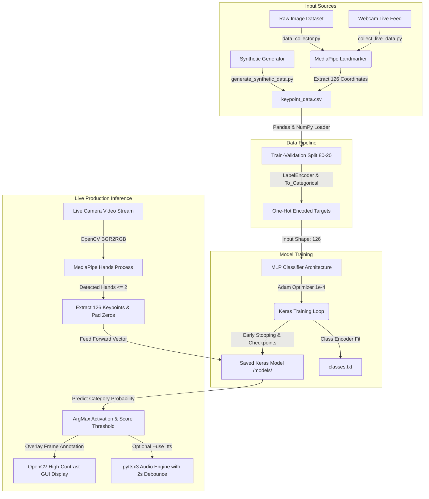

# 🖐️ Hybrid Real-Time Indian Sign Language (ISL) Detection System

[](https://www.python.org/)
[](https://www.tensorflow.org/)
[](https://google.github.io/mediapipe/)
[](https://opencv.org/)
[](LICENSE)

An advanced, end-to-end deep learning framework designed for **real-time classification of Indian Sign Language (ISL)** gestures. This system supports both **single-hand and two-hand static/dynamic gesture tracking** across **36 distinct classes (A-Z, 0-9)**. 

By migrating from heavy, background-sensitive, image-convolution-based models (such as ResNet/CNNs) to a lightweight **geometric keypoint-based classification pipeline**, this project achieves sub-millisecond inference times, complete environment invariance (background, illumination, skin tone), and superb accuracy on low-resource CPU/GPU edge systems.

---

## 📌 Table of Contents
1. [Project Overview & Philosophy](#-project-overview--philosophy)
2. [System Architecture](#%EF%B8%8F-system-architecture)
3. [Deep-Dive into Algorithms & Mechanics](#-deep-dive-into-algorithms--mechanics)
   - [MediaPipe Hand Keypoint Extraction](#1-mediapipe-hand-keypoint-extraction-algorithm)
   - [Multi-Layer Perceptron (MLP) Classifier](#2-multi-layer-perceptron-mlp-neural-network)
   - [Synthetic Keypoint Data Generator](#3-synthetic-keypoint-data-generation)
   - [Text-to-Speech (TTS) with Debouncing](#4-text-to-speech-tts-integration-with-debounce-timer)
4. [Tech Stack & System Dependencies](#-tech-stack--system-dependencies)
5. [Directory Structure](#-directory-structure)
6. [Installation & Environment Setup](#-installation--environment-setup)
7. [Step-by-Step Execution Pipeline](#%EF%B8%8F-step-by-step-execution-pipeline)
   - [Phase 1: Bootstrapping Synthetic Data](#phase-1-bootstrapping-synthetic-data)
   - [Phase 2: Custom Image Dataset Preprocessing](#phase-2-custom-image-dataset-preprocessing)
   - [Phase 3: Live Webcam Keypoint Data Collection](#phase-3-live-webcam-keypoint-data-collection)
   - [Phase 4: Multi-Layer Perceptron Model Training](#phase-4-multi-layer-perceptron-model-training)
   - [Phase 5: Offline Model Evaluation](#phase-5-offline-model-evaluation)
   - [Phase 6: Real-Time Live Webcam Inference](#phase-6-real-time-live-webcam-inference)
8. [MediaPipe Hand Landmark Landmark Reference Chart](#-mediapipe-hand-landmark-reference-chart)
9. [Future Roadmap & Contributions](#-future-roadmap--contributions)

---

## 🚀 Project Overview & Philosophy

Traditional hand gesture recognition systems rely on CNNs (e.g., ResNet, MobileNet) trained directly on raw images. While effective under controlled environments, they suffer from several fundamental bottlenecks:
* **Background Overfitting:** CNNs inadvertently memorize the room, furniture, or clothing colors.
* **Lighting & Skin-Tone Sensitivity:** Performance degrades significantly in low-light or varying skin-tone conditions.
* **High Computational Cost:** Feeding high-resolution images (`224x224x3` or larger) through deep convolutional layers is slow and drains energy on edge devices.

### 💡 The Geometric Keypoint Paradigm Shift
This hybrid system decouples **feature localization** from **classification**:
1. **MediaPipe Hands** acts as a robust, pre-trained feature extractor, converting an arbitrary `640x480` color frame into a standardized, scale-invariant set of **3D keypoints** (coordinates) for up to two hands.
2. A lightweight **Multi-Layer Perceptron (MLP)** classifies the mathematical relations between these points.

This architecture offers key benefits:
* **Background Invariance:** The classifier never sees the background; it only receives mathematical coordinate matrices.
* **Lightweight Profile:** The input is a simple vector of 126 floating-point values instead of millions of image pixels.
* **Blazing Fast Speeds:** The MLP runs in less than 2ms, enabling buttery-smooth 60+ FPS performance even on low-cost single-board computers (like Raspberry Pi) or older laptops.

---

## 🏗️ System Architecture

The following diagram describes the end-to-end data processing, model training, and real-time execution flow:



> To delete Trained Data

```powershell
Remove-Item -Recurse -Force models\sign_model_mlp_saved, models\sign_model_mlp_saved.keras, models\classes.txt, keypoint_data.csv
```

---

## 🧠 Deep-Dive into Algorithms & Mechanics

### 1. MediaPipe Hand Keypoint Extraction Algorithm
For every frame processed, Google's MediaPipe Hands localizes **21 3D joint coordinates** per hand. Each coordinate consists of:
* **$x$ & $y$:** Normalized coordinate positions scaled between $0.0$ and $1.0$ based on image width and height.
* **$z$:** Represents depth, with the wrist acting as the origin. The smaller the value, the closer the landmark is to the camera.

$$\text{Landmark Vector } (\vec{L}_i) = [x_i, y_i, z_i] \quad \text{for } i \in [0, 20]$$

#### Multi-Hand Standardization & Padding Equation
To process both single-hand signs (e.g., 'A', 'B') and two-hand signs (e.g., 'W', 'Y'), the input dimension must remain constant. The system processes a maximum of $M = 2$ hands:

$$\text{Total Expected Features} = 21 \text{ Landmarks} \times 3 \text{ Coordinates} \times 2 \text{ Hands} = 126 \text{ Features}$$

If only **one hand** is detected in the frame, the algorithm extracts the 63 coordinates of the detected hand, and pads the remaining 63 elements with $0.0$, preserving model input dimensionality:

$$\vec{F}_{\text{input}} = [\vec{L}^{(1)}_0, \vec{L}^{(1)}_1, \dots, \vec{L}^{(1)}_{20}, \underbrace{0.0, 0.0, \dots, 0.0}_{63 \text{ zero pads}}]$$

This logic is implemented dynamically inside the [utils.py](file:///c:/Users/HP/Hybrid-real-time-sign-language-detection-DL/utils.py#L23-L45) keypoint extractor:
```python
def extract_keypoints(results, max_hands=2):
    keypoints = []
    detected_hands = results.multi_hand_landmarks or []
    
    for hand_landmarks in detected_hands:
        for landmark in hand_landmarks.landmark:
            keypoints.extend([landmark.x, landmark.y, landmark.z])

    expected_features = 21 * 3 * max_hands 
    
    if len(keypoints) < expected_features:
        keypoints.extend([0.0] * (expected_features - len(keypoints)))
    
    keypoints = keypoints[:expected_features]
    return np.array([keypoints], dtype=np.float32)
```

---

### 2. Multi-Layer Perceptron (MLP) Neural Network
The core classification is driven by a deep feed-forward neural network implemented via TensorFlow/Keras. It maps the 126-dimensional keypoint vector to one of the 36 available sign classes.

#### Architecture Configuration
The neural network consists of five primary layers to prevent overfitting while capturing non-linear boundary limits:

| Layer Number | Type | Output Shape | Activation | Regularization | Purpose |
|--------------|------|--------------|------------|----------------|---------|
| **Layer 0** | `Input` | `(None, 126)` | None | None | Accepts normalized, padded 126 keypoint elements. |
| **Layer 1** | `Dense` | `(None, 256)` | `ReLU` | None | Learns high-level geometric spatial correlations. |
| **Layer 2** | `Dropout`| `(None, 256)` | None | `Rate = 0.3` | Randomly zeroes 30% of neurons to prevent overfitting. |
| **Layer 3** | `Dense` | `(None, 128)` | `ReLU` | None | Refines features into lower dimensional representations. |
| **Layer 4** | `Dropout`| `(None, 128)` | None | `Rate = 0.3` | Additional layer regularization. |
| **Layer 5** | `Dense` | `(None, 36)` | `Softmax`| None | Yields probability distribution across all 36 classes. |

#### Cost Optimization & Training Formulae
* **Objective Loss:** Categorical Cross-Entropy is calculated to compute the training error over $N$ categories:

$$\mathcal{L}_{CCE} = -\sum_{c=1}^{C} y_c \log(\hat{y}_c)$$

* **Optimizer:** Adam with a highly refined learning rate of $\alpha = 10^{-4}$ is utilized to avoid exploding gradients during backpropagation:

$$\theta_{t+1} = \theta_t - \frac{\alpha}{\sqrt{\hat{v}_t} + \epsilon} \hat{m}_t$$

* **Overfitting Safeguards:** Early Stopping is configured with a `patience=20` parameter on validation loss. Best weights are restored automatically to maintain maximum test generalization.

---

### 3. Synthetic Keypoint Data Generation
To test training mechanics and validate the neural network architecture before recording live data, the project incorporates a **synthetic keypoint generator** ([generate_synthetic_data.py](file:///c:/Users/HP/Hybrid-real-time-sign-language-detection-DL/generate_synthetic_data.py)).

#### Noise Injection Math
The script assigns a static, reproducible random "center vector" for each class $c$ in the continuous space $[0.1, 0.9]$:

$$\vec{C}_c \sim \mathcal{U}(0.1, 0.9)^{126}$$

For each of the 100 samples generated per class, small Gaussian noise representing structural tremor or camera jitter is added, and values are clipped to maintain normalized bounds:

$$\vec{X}_{\text{synthetic}} = \text{clip}\left(\vec{C}_c + \mathcal{N}(0, \sigma^2), 0.0, 1.0\right) \quad \text{where } \sigma = 0.05$$

This yields $3600$ highly learnable, distinct datasets to verify compile, training, and classification configurations.

---

### 4. Text-to-Speech (TTS) Integration with Debounce Timer
To assist visually impaired or non-sign language speakers, the system utilizes the `pyttsx3` offline speech engine to speak predicted gestures aloud. 

#### Debouncing Algorithm
Without debouncing, a camera processing at 30 FPS would attempt to call the TTS voice engine 30 times a second for the same character, resulting in a frozen interface and audio stutter. A custom **temporal debounce filter** is built using high-performance clock cycles:

$$\Delta t = t_{\text{current}} - t_{\text{last\_spoken}} > \tau \quad (\text{where } \tau = 2.0 \text{ seconds})$$

Speech synthesis only fires if the same sign has remained stable and the elapsed duration $\Delta t$ exceeds the 2.0-second threshold.

---

## 💻 Tech Stack & System Dependencies

* **Core Language:** Python 3.8 / 3.9 / 3.10 / 3.11
* **Deep Learning Framework:** TensorFlow 2.10+ / Keras (supporting CUDA on Windows/Linux, and `tensorflow-metal` on macOS)
* **Computer Vision:** OpenCV-Python 4.x
* **Coordinate Extraction:** Google MediaPipe 0.10.x
* **Scientific Computing & Data Prep:** NumPy, Pandas, Scikit-Learn
* **Speech Synthesis:** PyTTSp3 (cross-platform offline speech library)
* **Performance Bar:** tqdm (for visual loading indicators during conversion processes)

---

## 📁 Directory Structure

```text
HYBRID-SIGN-LANGUAGE-DETECTION/
│
├── .gitignore                      # Prevents local checkpoints, venv, and large datasets from being tracked
├── LICENSE                         # Project license (MIT)
├── README.md                       # Comprehensive project documentation
├── requirements.txt                # Consolidated package dependencies
│
├── keypoint_data.csv               # Shared tabular dataset containing 126 coordinate features & class labels
├── utils.py                        # Core library (MediaPipe coordinates extraction and zero-padding logic)
├── model.py                        # Defines the Keras Multi-Layer Perceptron (MLP) architecture
│
├── generate_synthetic_data.py      # Generates a randomized, mathematical dataset for validation
├── data_collector.py               # Preprocesses raw custom image folders into keypoint coordinate rows
├── collect_live_data.py            # Streamlined webcam recorder for custom live-user dataset creation
│
├── train_mlp.py                    # MLP model trainer (incorporating GPU memory management & callbacks)
├── evaluate_model.py               # Computes validation metrics, accuracy, and detailed classification reports
├── infer_realtime.py               # Live camera inference loop with pyttsx3 Text-to-Speech support
│
├── models/                         # Model weights and target configurations directory
│   ├── classes.txt                 # Exported class labels corresponding to label-encoder indices
│   └── sign_model_mlp_saved/       # Serialized Keras saved model (best performance weights)
│
└── venv/                           # Python isolated virtual environment (recommended)
```

---

## 🛠️ Installation & Environment Setup

Follow these commands to configure the environment and run the workspace cleanly on your operating system:

### 1. Clone & Open Directory
```bash
git clone https://github.com/ruchidhapola/Hybrid-real-time-sign-language-detection-DL.git
cd Hybrid-real-time-sign-language-detection-DL
```

### 2. Configure Virtual Environment
* **Windows (PowerShell):**
  ```powershell
  python -m venv venv
  .\venv\Scripts\Activate.ps1
  ```
* **macOS / Linux:**
  ```bash
  python3 -m venv venv
  source venv/bin/activate
  ```

### 3. Install Required Dependencies
Ensure you upgrade pip and install all packages.
```bash
pip install --upgrade pip
pip install -r requirements.txt
```

> [!NOTE]
> For **Apple Silicon (M1/M2/M3)** users, ensure you have the appropriate macOS-optimized backend installed to leverage hardware acceleration:
> `pip install tensorflow-macos tensorflow-metal`

---

## 🔄 Step-by-Step Execution Pipeline

You can implement, train, and run the pipeline using synthetic data, custom image datasets, or live captured webcam features.

---

### Phase 1: Bootstrapping Synthetic Data
Generate a clean, mathematical coordinate dataset to verify the network compiles and learns without requiring physical camera hardware:
```bash
python generate_synthetic_data.py
```
* **Output:** Creates a unified `keypoint_data.csv` in your project root containing $3,600$ pre-labeled rows of coordinates across $36$ distinct classes.

---

### Phase 2: Custom Image Dataset Preprocessing
If you have an existing image dataset (such as downloaded Kaggle ISL images), arrange them inside the project root under the following nested directory structure:
```text
dataset/
├── train/
│   ├── A/ (contains JPG/PNG files representing letter A)
│   ├── B/ (contains JPG/PNG files representing letter B)
│   └── ...
└── val/
    ├── A/
    ├── B/
    └── ...
```
To parse these images, detect hand regions, extract keypoints, and add them to the CSV dataset, execute:
```bash
python data_collector.py
```
* **Output:** Reads every image matching `.jpg`, `.jpeg`, or `.png`, processes them through MediaPipe Hands in static mode, and appends the coordinate array along with the directory name (e.g., "A", "B") into `keypoint_data.csv`.

---

### Phase 3: Live Webcam Keypoint Data Collection
If you wish to record your own custom hand gestures using your local webcam:
```bash
# General Syntax: python collect_live_data.py -c <CLASS_NAME> -s <NUMBER_OF_SAMPLES>
python collect_live_data.py --classname A --samples 150
```
#### Live UI Recorder Hotkeys:
* Press **`s`** to start the capture sequence. The text overlay will change from green `READY` to red `RECORDING`. Keep performing variations of the sign in front of the lens.
* Press **`q`** to abort or save early.
* **Smart Dataset Cleaner:** If the CSV file only contains synthetic mock data, the script automatically purges the synthetic data, creating a clean, pristine, custom-recorded dataset.

---

### Phase 4: Multi-Layer Perceptron Model Training
Once `keypoint_data.csv` is populated with coordinate samples, initiate model training:
```bash
python train_mlp.py
```
#### Training Behavior:
* Scans local hardware; if a compatible GPU (CUDA or MPS) is found, memory growth is initiated automatically to maximize training performance.
* Loads `keypoint_data.csv`, encodes labels dynamically, and saves the resulting target configurations to `models/classes.txt`.
* Performs a stratified $80/20$ train-validation split.
* Saves the optimal model weights on validation accuracy to `models/sign_model_mlp_saved/`.
* Halts automatically if the validation loss plateaus for 20 continuous epochs.

---

### Phase 5: Offline Model Evaluation
Check metrics, view confusion factors, and audit precise performance scores per class:
```bash
python evaluate_model.py
```
* **Output:** Re-splits training/validation subsets identically to preserve testing integrity, evaluates accuracy, and outputs a complete scikit-learn Classification Report detailing:
  * **Precision:** Ratio of correctly predicted positive observations to the total predicted positives.
  * **Recall (Sensitivity):** Ratio of correctly predicted positive observations to all observations in the actual class.
  * **F1-Score:** Harmonic mean of Precision and Recall.
  * **Support:** The number of occurrences of each class in the specified dataset.

---

### Phase 6: Real-Time Live Webcam Inference
Launch the real-time classification application. This reads camera video streams, translates hand signs instantly, overlays labels on-screen, and optionally voices them out loud:
```bash
# Basic real-time execution
python infer_realtime.py

# Launch with Text-To-Speech (TTS) vocalization enabled
python infer_realtime.py --use_tts

# Run with a custom confidence threshold (e.g., only show predictions with > 85% probability)
python infer_realtime.py --threshold 0.85
```
* **Output:** Opens a local OpenCV camera window displaying a live feed. MediaPipe skeletal green lines are drawn over your hands. The predicted letter or number alongside its confidence score is displayed in the top-left corner. If `--use_tts` is enabled, the system will speak the predicted gestures aloud.

---

## 📊 MediaPipe Hand Landmark Reference Chart

MediaPipe Hands tracks $21$ coordinates per hand. These map to the following positions:

```text
    🖐️ LANDMARK INDEX CHART:
    
          (8) Tip          (12) Tip         (16) Tip         (20) Tip
           |                |                |                |
          (7) Dip          (11) Dip         (15) Dip         (19) Dip
           |                |                |                |
          (6) Pip          (10) Pip         (14) Pip         (18) Pip
           |                |                |                |
    (4)   (5) Mcp          (9) Mcp          (13) Mcp         (17) Mcp
     \     /________________/________________/________________/
     (3)  /
      \  /
      (2)
       \
       (1)
        \
        (0) Wrist
```

* **Thumb:** `0` (Wrist) $\rightarrow$ `1` $\rightarrow$ `2` $\rightarrow$ `3` $\rightarrow$ `4` (Tip)
* **Index Finger:** `5` $\rightarrow$ `6` $\rightarrow$ `7` $\rightarrow$ `8` (Tip)
* **Middle Finger:** `9` $\rightarrow$ `10` $\rightarrow$ `11` $\rightarrow$ `12` (Tip)
* **Ring Finger:** `13` $\rightarrow$ `14` $\rightarrow$ `15` $\rightarrow$ `16` (Tip)
* **Pinky Finger:** `17` $\rightarrow$ `18` $\rightarrow$ `19` $\rightarrow$ `20` (Tip)

During keypoint extraction, these landmarks are serialized sequentially for hand 1 and hand 2, generating the 126-dimensional input vector.

---

## 🔮 Future Roadmap & Contributions

Contributions to enhance this open-source project are highly encouraged! Planned improvements include:
1. **Dynamic Gesture Parsing (LSTM / GRU / Transformer):** Moving from static frame coordinates to temporal coordinate arrays over multiple frames to classify sequential, sentence-length sign-language expressions.
2. **Mobile Implementation:** Exporting the trained Keras MLP weights to `.tflite` (TensorFlow Lite) format to build a highly responsive mobile application.
3. **Advanced Calibration:** Implementing a localized distance normalization algorithm that rescales joint distances relative to the hand's wrist-to-mcp distance. This eliminates coordinate variations caused by moving closer or further away from the lens.

### How to Contribute
1. Fork the Repository.
2. Create your Feature Branch (`git checkout -b feature/AmazingFeature`).
3. Commit your changes (`git commit -m 'Add some AmazingFeature'`).
4. Push to the Branch (`git push origin feature/AmazingFeature`).
5. Open a Pull Request.

---

*Developed with ❤️ for accessibility and real-time computer vision applications.*
